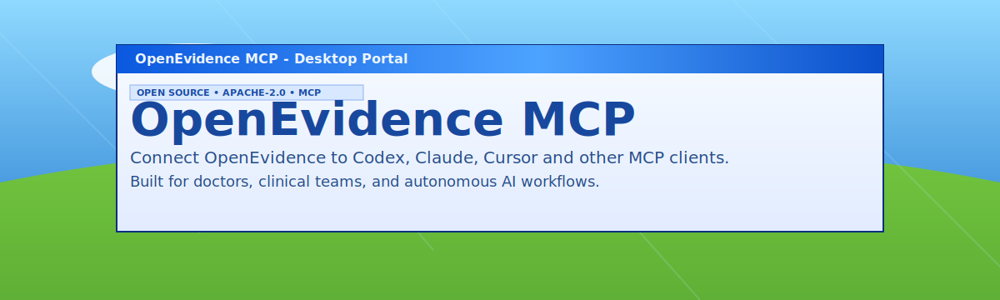

<p align="center">
  
</p>

<h1 align="center">OpenEvidence MCP (Cookie Auth Fork)</h1>

<p align="center">
  Use OpenEvidence from Claude Code, Codex CLI, Gemini CLI, Claude Desktop, Cursor, Cline, Continue, and any MCP-compatible client.
</p>

<p align="center">
  <a href="https://www.apache.org/licenses/LICENSE-2.0"></a>
  <a href="https://github.com/bakhtiersizhaev/openevidence-mcp"></a>
  <a href="https://modelcontextprotocol.io"></a>
  <a href="https://www.npmjs.com/package/@modelcontextprotocol/sdk"></a>
  <a href="https://www.typescriptlang.org"></a>
  
  
  
  
  
  
  
  
  
</p>

## What It Does

This is an unofficial OpenEvidence MCP server that reuses cookies exported from your own logged-in OpenEvidence browser session. It does not launch a browser, does not install Playwright, and does not need an official OpenEvidence API key.

It is designed for local personal workflows where you already have lawful access to OpenEvidence. It does not bypass authentication, remove access controls, redistribute OpenEvidence content, or include OpenEvidence data in this repository.

Tools:

| Tool | Purpose |
| --- | --- |
| `oe_auth_status` | Check `/api/auth/me` with your cookie file |
| `oe_history_list` | Read OpenEvidence history |
| `oe_article_get` | Fetch an article by id and save artifacts |
| `oe_ask` | Ask a question, optionally wait, and save artifacts |

Saved artifacts:

| File | Purpose |
| --- | --- |
| `article.json` | Full OpenEvidence article payload |
| `answer.md` | Extracted markdown answer |
| `citations.json` | Parsed structured citations |
| `citations.bib` | BibTeX bibliography |
| `crossref-validation.json` | Post-hoc Crossref validation results |

## Fast Install

```bash
git clone https://github.com/htlin222/openevidence-mcp.git
cd openevidence-mcp
npm install
npm run build
```

Export cookies from a logged-in `https://www.openevidence.com` browser session and put them here:

```bash
cp /path/to/browser-cookies.json ./cookies.json
npm run login
npm run smoke
```

The cookie file can be a browser-exported cookies array or a storage-state object with a `cookies` array.

## Register With MCP Clients

Use one of these.

### Claude Code

```bash
make install-claude-global
claude mcp get openevidence
```

What it registers:

```text
node /ABSOLUTE/PATH/openevidence-mcp/dist/server.js
OE_MCP_COOKIES_PATH=/ABSOLUTE/PATH/openevidence-mcp/cookies.json
```

### Codex CLI

```bash
make install-codex-global
codex mcp get openevidence
```

Equivalent manual command:

```bash
codex mcp add openevidence \
  --env OE_MCP_COOKIES_PATH="$PWD/cookies.json" \
  -- node "$PWD/dist/server.js"
```

Manual `~/.codex/config.toml`:

```toml
[mcp_servers.openevidence]
command = "node"
args = ["/ABSOLUTE/PATH/openevidence-mcp/dist/server.js"]
startup_timeout_sec = 60

[mcp_servers.openevidence.env]
OE_MCP_COOKIES_PATH = "/ABSOLUTE/PATH/openevidence-mcp/cookies.json"
```

### Gemini CLI

```bash
make install-gemini-global
gemini mcp list
```

Equivalent manual command:

```bash
gemini mcp add --scope user \
  -e OE_MCP_COOKIES_PATH="$PWD/cookies.json" \
  openevidence node "$PWD/dist/server.js"
```

### Claude Desktop, Cursor, Cline, Continue

Use this `mcpServers` shape:

```json
{
  "mcpServers": {
    "openevidence": {
      "command": "node",
      "args": ["/ABSOLUTE/PATH/openevidence-mcp/dist/server.js"],
      "env": {
        "OE_MCP_COOKIES_PATH": "/ABSOLUTE/PATH/openevidence-mcp/cookies.json"
      }
    }
  }
}
```

### Install Everywhere

```bash
make install-all
```

This registers the same local stdio server with Claude Code, Codex CLI, and Gemini CLI.

## Verify

```bash
npm run check
npm test
npm run build
npm run smoke
```

Expected smoke result:

```json
{
  "ok": true,
  "authenticated": true
}
```

MCP stdio servers normally start on demand when the client checks or uses them. They do not need to run as a separate daemon.

## Citation Artifacts

Completed `oe_ask` and `oe_article_get` calls save artifacts under:

```text
/tmp/openevidence-mcp/<article_id>/
```

On macOS, Node may resolve `/tmp` to a path under `/var/folders/.../T/`.

Example output:

```text
answer.md
article.json
citations.json
citations.bib
crossref-validation.json
```

Crossref validation behavior:

- DOI citations are validated directly with Crossref.
- Non-DOI citations use a bibliographic query and are marked as `candidate`, `not_found`, or `error`.
- Low-similarity Crossref matches are not used to overwrite BibTeX metadata.
- Sources like NCCN guidelines may stay as local OpenEvidence metadata because Crossref often has no authoritative match.

## Copyright, Trademark, And Medical Disclaimer

This project is unofficial and independent. It is not affiliated with, endorsed by, sponsored by, or approved by OpenEvidence or its owners. "OpenEvidence" and related names, logos, product names, and content remain the property of their respective owners.

This repository contains connector code only. It does not include OpenEvidence copyrighted content, proprietary datasets, model outputs, article payloads, session cookies, or account material. Your local use of this MCP server may create files such as `answer.md`, `article.json`, and `citations.bib`; those artifacts can contain content retrieved from or derived from your OpenEvidence account session. Treat those files as private unless you have the right to share them.

You are responsible for complying with OpenEvidence terms, institutional policies, copyright law, and any clinical data governance rules that apply to your use. Do not publish cookies, account tokens, saved article payloads, generated answers, screenshots, guideline text, or other protected/copyrighted content unless you have permission or another valid legal basis.

This software is not medical advice and is not a medical device. It is an integration tool for an MCP client. Clinicians and qualified users remain responsible for verifying outputs against authoritative sources and applying independent clinical judgment.

## Cookie Refresh

If auth stops working:

```bash
cp /path/to/fresh-browser-cookies.json ./cookies.json
npm run login
```

Then restart or open a fresh MCP client session if the old stdio server process is still alive.

## Make Targets

| Target | Purpose |
| --- | --- |
| `make deps` | Run `npm install` |
| `make build` | Compile TypeScript |
| `make check` | Type-check |
| `make test` | Run unit tests |
| `make smoke` | Validate auth and history access |
| `make import-cookies COOKIES=/path/to/cookies.json` | Import and verify cookies |
| `make install-claude-global` | Register with Claude Code user config |
| `make install-codex-global` | Register with Codex CLI |
| `make install-gemini-global` | Register with Gemini CLI user config |
| `make install-all` | Register with Claude Code, Codex CLI, and Gemini CLI |

## Environment Variables

| Variable | Default | Purpose |
| --- | --- | --- |
| `OE_MCP_BASE_URL` | `https://www.openevidence.com` | OpenEvidence base URL |
| `OE_MCP_ROOT_DIR` | `~/.openevidence-mcp` | Root for default auth paths |
| `OE_MCP_COOKIES_PATH` | `./cookies.json` if present, else `~/.openevidence-mcp/auth/cookies.json` | Cookie file |
| `OE_MCP_AUTH_STATE_PATH` | unset | Legacy alias for `OE_MCP_COOKIES_PATH` |
| `OE_MCP_ARTIFACT_DIR` | OS temp dir + `openevidence-mcp` | Artifact output directory |
| `OE_MCP_CROSSREF_MAILTO` | unset | Optional Crossref polite-pool email |
| `OE_MCP_CROSSREF_VALIDATE` | `1` | Set `0` to skip Crossref validation |
| `OE_MCP_POLL_INTERVAL_MS` | `1200` | Poll interval for `oe_ask` |
| `OE_MCP_POLL_TIMEOUT_MS` | `180000` | Default poll timeout |

## Project Files

- [README.AI.md](README.AI.md) - agent install playbook
- [examples/codex-config.toml](examples/codex-config.toml) - Codex MCP config
- [examples/claude-desktop-config.json](examples/claude-desktop-config.json) - JSON MCP config
- [src/citations.ts](src/citations.ts) - citation extraction, BibTeX, Crossref validation
- [src/cookies.ts](src/cookies.ts) - cookie file parsing
- [src/server.ts](src/server.ts) - MCP tools
- [test/citations.test.ts](test/citations.test.ts) - unit tests

## License And Attribution

Apache-2.0. Keep [LICENSE](LICENSE) and [NOTICE](NOTICE) when redistributing.

Based on OpenEvidence MCP by Bakhtier Sizhaev: `https://github.com/bakhtiersizhaev/openevidence-mcp`
